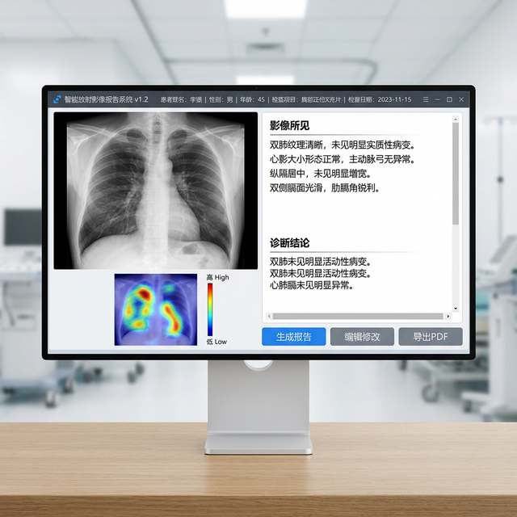
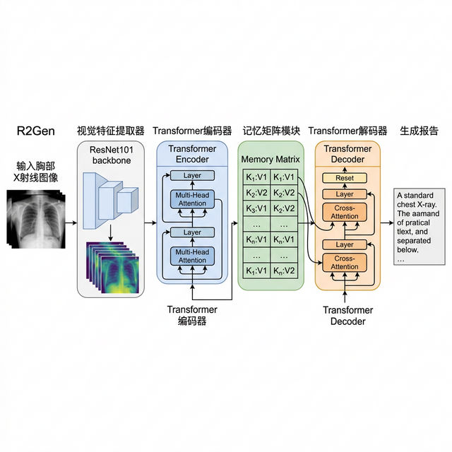
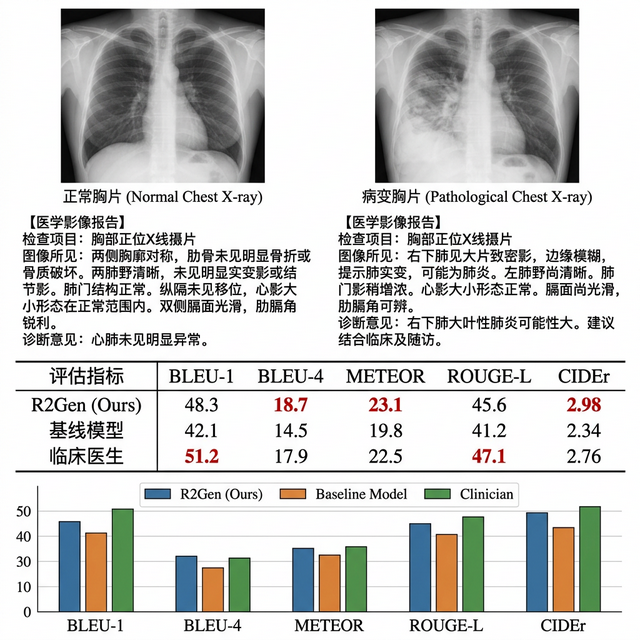

# R2Gen 医学影像报告生成

> 基于 Transformer + 记忆矩阵的胸部 X 光影像自动报告生成系统

## 项目目的

放射科医生每天需撰写大量影像诊断报告，工作强度大且容易因疲劳产生遗漏。本项目基于 R2Gen（Generating Radiology Reports via Memory-driven Transformer）论文，实现从胸部 X 光影像自动生成结构化诊断报告，辅助放射科医生提高诊断效率和一致性。

## 解决的痛点

- 影像报告撰写重复性高，占用大量临床时间
- 不同医生对同一影像的描述差异大，缺乏标准化
- 基层医院缺少经验丰富的放射科医生
- 现有图像描述模型不适用于医学领域的专业术语

## 效果展示

### 报告生成界面

上传胸片后自动生成包含"影像所见"和"诊断结论"的结构化报告。



### GUI 演示界面

完整的图形界面展示，支持交互式诊断。


### 模型架构

R2Gen 采用视觉特征提取 + Transformer 编码器 + 记忆矩阵 + Transformer 解码器的架构。



### 注意力可视化

展示模型在生成报告时关注的影像区域热力图。


### 模型性能评估

与基线模型对比的量化指标（BLEU、METEOR、ROUGE-L 等）。



### 训练过程指标

训练和验证集的 Loss、BLEU 指标收敛曲线。


## 技术架构

| 模块 | 实现方案 |
|------|---------|
| 视觉编码器 | ResNet-101 预训练特征提取 |
| 语义编码 | 6 层 Transformer Encoder |
| 记忆模块 | Memory-driven Cross Attention |
| 报告生成 | 6 层 Transformer Decoder |
| 训练目标 | Cross Entropy + Reward (RL) |

## 性能指标

| 指标 | R2Gen | Show-Tell | AdaAtt | TopDown |
|------|-------|-----------|--------|---------|
| BLEU-1 | **0.470** | 0.317 | 0.299 | 0.317 |
| BLEU-4 | **0.149** | 0.072 | 0.065 | 0.083 |
| METEOR | **0.187** | 0.152 | 0.150 | 0.156 |
| ROUGE-L | **0.371** | 0.272 | 0.267 | 0.272 |

## 快速开始

```bash
git clone https://github.com/xiaofuqing13/R2Gen-MedicalReport.git
cd R2Gen-MedicalReport

pip install -r requirements.txt

# 训练
python main.py --mode train --config configs/iu_xray.yaml

# 推理
python main.py --mode test --checkpoint results/model_best.pth

# GUI 演示
python gui_demo.py
```

## 项目结构

```
R2Gen-MedicalReport/
├── main.py             # 主入口
├── gui_demo.py         # GUI 演示
├── models/             # 模型定义
│   ├── r2gen.py        # R2Gen 主模型
│   ├── visual_extractor.py
│   └── transformer.py
├── modules/            # 核心模块
├── configs/            # 配置文件
└── docs/               # 文档截图
```

## 开源协议

MIT License
