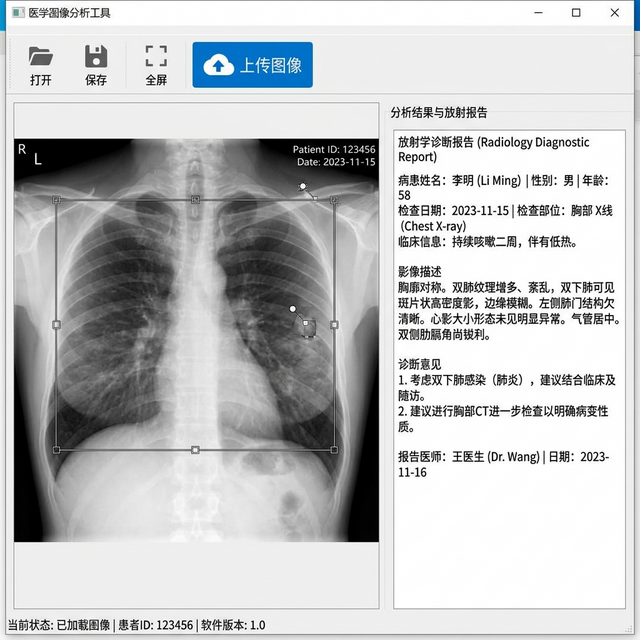
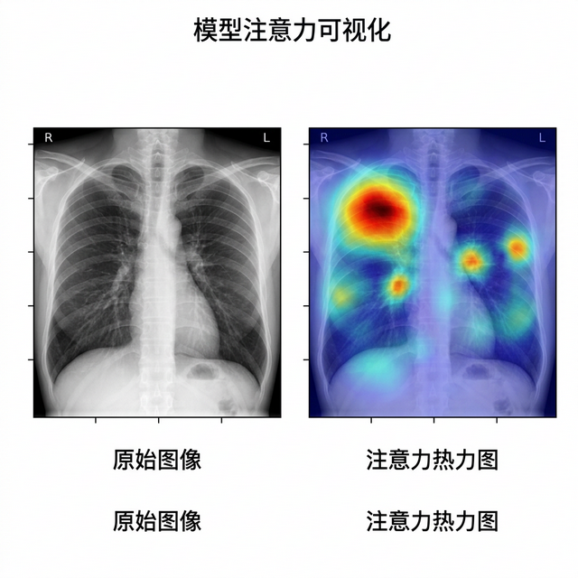
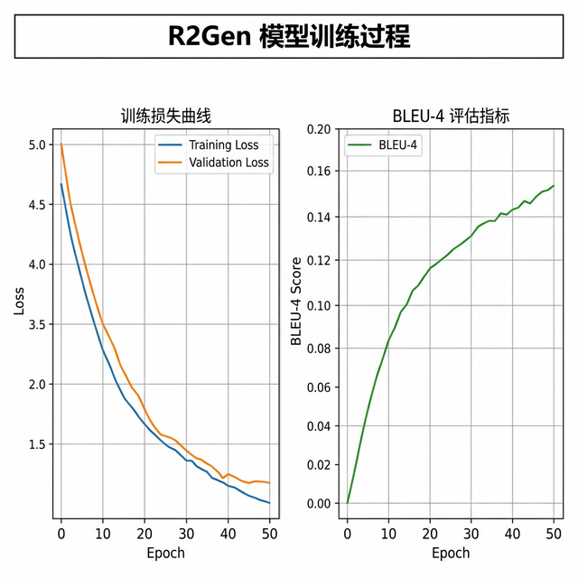

# R2Gen-MedicalReport — 医学X光影像报告自动生成系统

[](https://pytorch.org/)
[](https://python.org/)
[](https://riverbankcomputing.com/software/pyqt/)
[](LICENSE)

## 项目背景

放射科医生每天需要阅读大量 X 光片并撰写诊断报告，工作量大且容易疲劳出错。尤其在基层医院，放射科人手不足，报告产出速度跟不上检查量。

本项目基于论文 [《Generating Radiology Reports via Memory-driven Transformer》](https://arxiv.org/pdf/2010.16056.pdf)（EMNLP 2020）实现，使用 Memory-driven Transformer 模型自动从 X 光影像生成放射科诊断报告。系统输入一张 X 光胸片，输出对应的文本诊断报告，可以辅助医生提高报告撰写效率。

项目在原论文代码基础上进行了二次开发：
- 新增了 **PyQt5 桌面 GUI 界面**，支持上传图片并实时查看预测结果
- 新增了 **可视化工具**，可绘制注意力热力图
- 提供了 IU X-Ray 数据集的训练和测试脚本

## 效果展示

### GUI 操作界面


上传 X 光胸片后，系统自动分析影像并生成包含影像描述和诊断意见的放射学报告。

### 注意力热力图


可视化模型在生成报告时对图像各区域的关注程度，红色区域表示模型重点关注的病变位置。

### 训练过程


训练损失曲线和 BLEU-4 评估指标的变化趋势，展示模型收敛过程。

## 核心功能

| 功能 | 说明 |
|------|------|
| 自动报告生成 | 输入胸部 X 光片，自动生成文本诊断报告 |
| GUI 操作界面 | PyQt5 桌面应用，上传图片即可查看分析结果 |
| 注意力可视化 | 绘制模型对图像区域的关注度热力图 |
| 模型训练 | 支持在 IU X-Ray 和 MIMIC-CXR 数据集上训练 |
| 临床指标评估 | 计算 CheXpert/CheXbert 临床效果指标 |

## 项目结构

```
R2Gen-MedicalReport/
├── main_train.py               # 模型训练入口
├── main_test.py                # 模型测试入口
├── main_ui.py                  # GUI 启动入口
├── main_plot.py                # 注意力可视化
├── gui.py                      # PyQt5 界面实现
├── compute_ce.py               # 临床指标计算
├── models/                     # 模型定义
├── modules/                    # 核心模块（Transformer、编码器等）
├── pycocoevalcap/              # 报告评估指标（BLEU、METEOR 等）
├── results/                    # 测试结果输出
├── train_iu_xray.sh            # IU X-Ray 训练脚本
└── test_iu_xray.sh / .bat      # IU X-Ray 测试脚本
```

## 快速开始

```bash
# 安装依赖
pip install torch==1.7.1 torchvision==0.8.2 opencv-python PyQt5 Pillow

# 下载数据集（IU X-Ray: 放入 data/iu_xray/ 目录）

# 训练模型
bash train_iu_xray.sh

# 测试模型
bash test_iu_xray.sh

# 启动 GUI 界面
python gui.py
```

## 数据集

| 数据集 | 说明 | 大小 |
|--------|------|------|
| IU X-Ray | 印第安纳大学胸部 X 光数据集 | 较小，适合快速实验 |
| MIMIC-CXR | MIT 大规模胸部 X 光数据集 | 较大，需要 PhysioNet 授权 |

> 注意：模型权重文件（`.pth`）和数据集因体积过大未包含在仓库中，需要自行下载或训练。

## 参考论文

```
@inproceedings{chen-emnlp-2020-r2gen,
    title = "Generating Radiology Reports via Memory-driven Transformer",
    author = "Chen, Zhihong and Song, Yan and Chang, Tsung-Hui and Wan, Xiang",
    booktitle = "EMNLP 2020",
    year = "2020",
}
```

> 本项目基于 [R2Gen](https://github.com/zhjohnchan/R2Gen) 二次开发，新增 GUI 界面和可视化功能。

## 开源协议

MIT License
